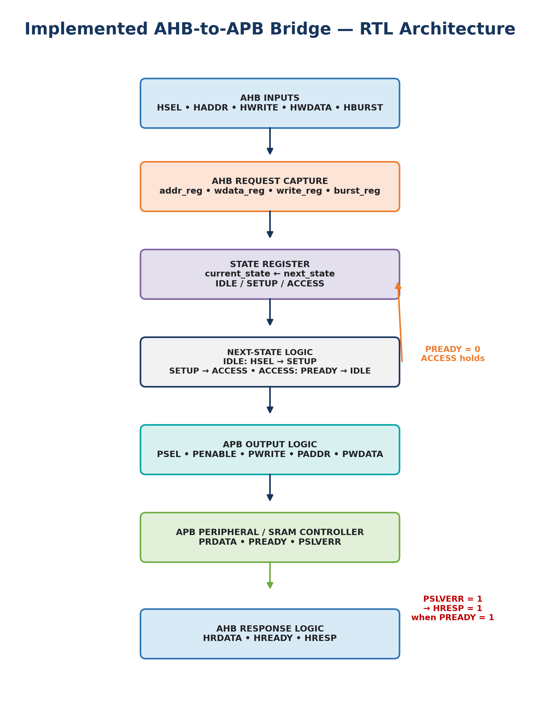
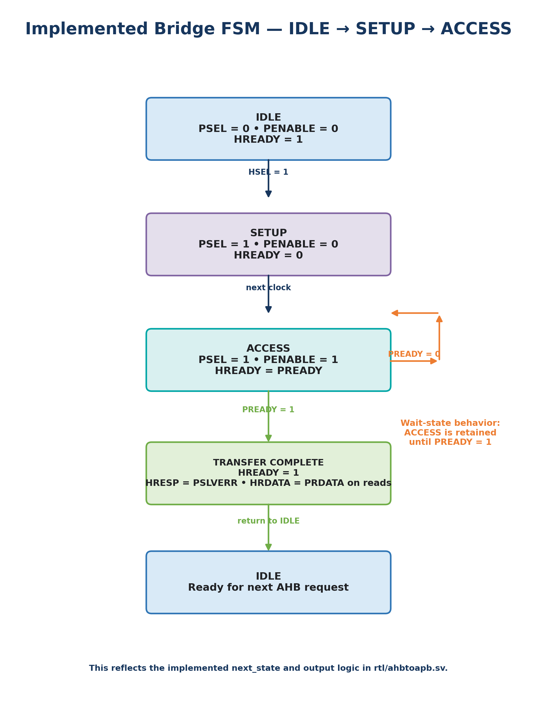
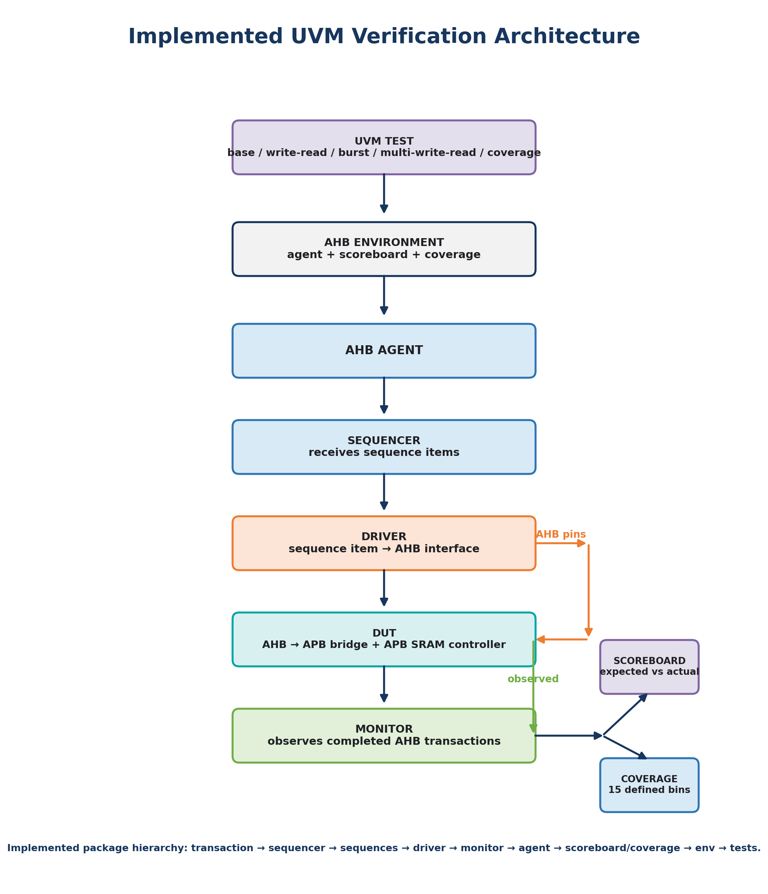
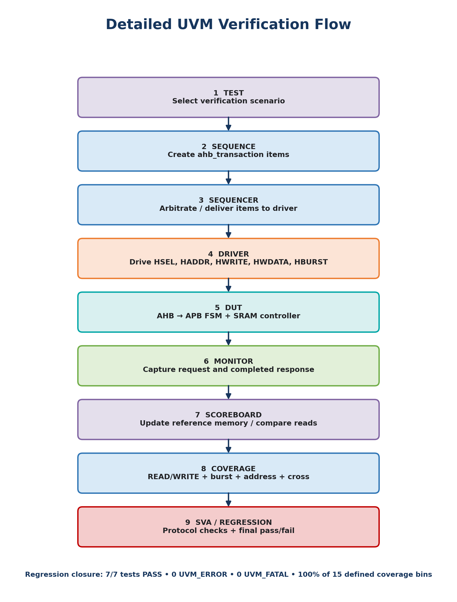
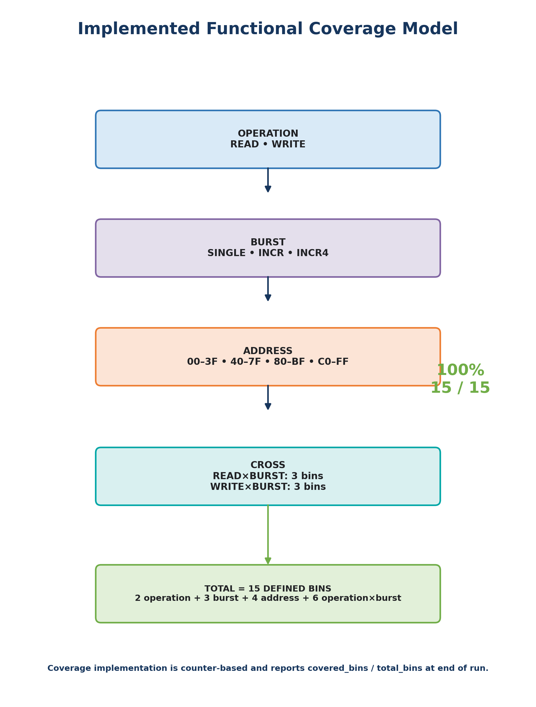
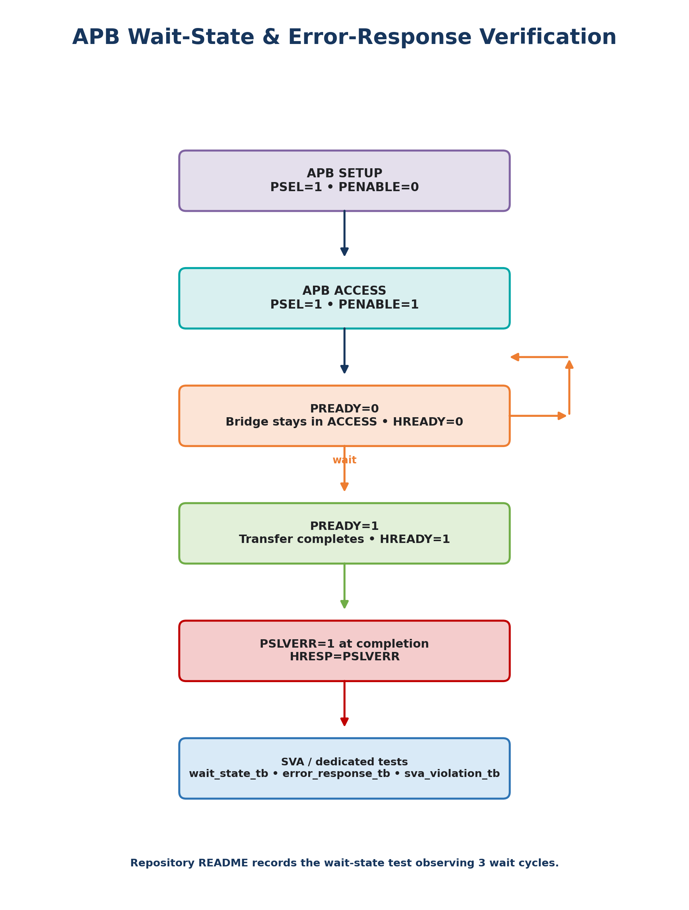

# AHB-to-APB Bridge — RTL Design & UVM Verification

<p align="center">
  <strong>SystemVerilog · UVM · AMBA AHB/APB · RTL/FSM · SVA · Functional Coverage · Questa</strong>
</p>

<p align="center">
  <a href="https://github.com/sahil9325/AHB-TO-APB-UVM">Repository</a> ·
  <a href="https://github.com/sahil9325/AHB-TO-APB-UVM/tree/development">Development Branch</a>
</p>

---

## Executive Snapshot

A complete **AHB-to-APB bridge RTL and verification project** implemented in SystemVerilog.

The implemented bridge captures an AHB request, translates it through an **IDLE → SETUP → ACCESS** FSM, drives an APB transaction to an SRAM controller, handles APB wait states, and propagates `PSLVERR` to the AHB-side `HRESP`.

The verification environment uses **UVM**, a reference-memory scoreboard, functional coverage and SVA-based protocol checking.

| Result | Final Status |
|---|---:|
| Regression | **7 / 7 PASS** |
| Functional coverage | **100% — 15 / 15 defined bins** |
| UVM errors | **0** |
| UVM fatal errors | **0** |
| Burst bins | **SINGLE / INCR / INCR4** |
| APB wait-state test | **PASS** |
| APB error-response test | **PASS** |
| SVA violation test | **PASS** |

> **Coverage note:** 100% refers to the 15 functional bins explicitly defined in `coverage/ahb_coverage.sv`; it is not a claim that the design is mathematically bug-free.

---

# 1. Implemented RTL Architecture



The diagram above follows the actual structure of `rtl/ahbtoapb.sv`:

- AHB request inputs: `HSEL`, `HADDR`, `HWRITE`, `HWDATA`, `HBURST`
- Request capture registers: `addr_reg`, `wdata_reg`, `write_reg`, `burst_reg`
- State register: `current_state`
- Next-state logic: `IDLE`, `SETUP`, `ACCESS`
- APB output logic: `PSEL`, `PENABLE`, `PWRITE`, `PADDR`, `PWDATA`
- AHB response logic: `HRDATA`, `HREADY`, `HRESP`
- APB inputs: `PRDATA`, `PREADY`, `PSLVERR`

The bridge's implemented RTL uses separate sequential logic for state/request capture and combinational logic for next-state, APB outputs and AHB response generation.

---

# 2. Implemented Bridge FSM



### State behavior

**IDLE**
- Captures a request when `HSEL=1`.
- `HREADY=1`.

**SETUP**
- `PSEL=1`
- `PENABLE=0`
- `HREADY=0`

**ACCESS**
- `PSEL=1`
- `PENABLE=1`
- `HREADY=PREADY`
- Remains in ACCESS while `PREADY=0`.
- On completion, `HRESP=PSLVERR`.
- For reads, `HRDATA=PRDATA`.

These behaviors are directly reflected in the implemented bridge RTL. citeturn1view0

---

# 3. Complete UVM Architecture



The actual UVM package includes:

`transaction → sequencer → sequences → driver → monitor → agent → scoreboard → coverage → environment → tests`

The environment instantiates the AHB agent, scoreboard and coverage subscriber, while the agent contains the sequencer, driver and monitor. citeturn1view1

### UVM data flow

**Sequence → Sequencer → Driver → DUT → Monitor → Scoreboard / Coverage**

The driver drives the AHB virtual interface, while the monitor publishes observed transactions through its analysis port.

---

# 4. Detailed Verification Flow



The completed environment contains dedicated stimulus for:

- Basic write/read
- Multiple write/read transactions
- INCR burst traffic
- Coverage-closure traffic

The package explicitly includes these sequences and tests. citeturn1view1

---

# 5. Functional Coverage Model



The implemented coverage model defines exactly **15 bins**:

- **2 operation bins:** READ, WRITE
- **3 burst bins:** SINGLE, INCR, INCR4
- **4 address bins:** `00–3F`, `40–7F`, `80–BF`, `C0–FF`
- **6 operation × burst bins:** READ×3 + WRITE×3

Total:

**2 + 3 + 4 + 6 = 15 bins**

The coverage source explicitly defines `total_bins = 15` and reports `covered_bins / total_bins`. citeturn1view2

### Final result

**100% functional coverage = 15 / 15 defined bins**

---

# 6. APB Wait-State & Error Verification



The verification suite checks:

### Wait states

`PREADY=0` keeps the bridge in ACCESS and holds AHB completion until the peripheral becomes ready.

The repository's documented wait-state test observes **3 wait cycles** before completion. citeturn1view3

### Error response

At APB transfer completion:

```text
HRESP = PSLVERR
```

The implemented bridge RTL explicitly propagates `PSLVERR` to `HRESP` when `PREADY=1`. citeturn1view0

---

# 7. Regression Results

| # | Test | Result |
|---:|---|:---:|
| 1 | Basic Write/Read | **PASS** |
| 2 | Multiple Write/Read | **PASS** |
| 3 | INCR Burst | **PASS** |
| 4 | Coverage Closure | **PASS** |
| 5 | SVA Violation | **PASS** |
| 6 | APB Wait State | **PASS** |
| 7 | APB Error Response | **PASS** |

**7 / 7 PASS · 0 failed**

The SVA violation test is intentionally designed to detect a protocol violation; detection of the expected violation is the PASS condition. citeturn1view3

---

# 8. Repository Structure

```text
AHB-TO-APB-UVM/
├── rtl/            # AHB-to-APB bridge + SRAM RTL
├── interface/      # AHB interface / simulation interface
├── transaction/    # UVM transaction
├── sequence/       # UVM sequences
├── sequencer/      # UVM sequencer
├── driver/         # AHB driver
├── monitor/        # AHB monitor
├── agent/          # UVM agent
├── scoreboard/     # Reference-memory checking
├── coverage/       # Functional coverage
├── env/            # UVM environment
├── test/           # UVM tests
├── assertions/     # SVA + dedicated protocol tests
├── top/            # Simulation top
├── sim/            # Questa regression/debug scripts
├── docs/           # Verification documentation
└── ahb_uvm_pkg.sv  # UVM package
```

---

# 9. Interactive Project Summary

## 🔎 Explore the Project Visually

For a presentation-style walkthrough of the complete implementation and verification work:

**[▶ Open the Interactive AHB-to-APB Project Summary]((https://sahil9325.github.io/AHB-TO-APB-UVM/project_summary/AHB_APB_Bridge_Summary.html))**

The HTML summary is intended as the **visual executive overview**, while this README provides the technical documentation and source-code navigation.

---

# 10. Simulation

The repository includes Questa/ModelSim simulation and regression scripts.

```bash
cd ~/majorproj
chmod +x sim/regression.sh
./sim/regression.sh
```

Individual UVM test:

```bash
vsim -c work.tb_top +UVM_TESTNAME=write_read_test -do "run -all; quit -f"
```

---

# 11. Technology Stack

`SystemVerilog` · `UVM` · `AMBA AHB/APB` · `RTL/FSM` · `SVA` · `Functional Coverage` · `Questa/ModelSim` · `Vivado` · `Linux/WSL` · `Git/GitHub`

---

# 12. Key Verification Concepts Demonstrated

- AMBA AHB/APB protocol conversion
- FSM-based RTL control
- AHB request capture and APB signal generation
- APB SRAM integration
- UVM transaction-level stimulus
- Sequencer / driver / monitor architecture
- Scoreboard reference-memory checking
- Functional and cross coverage
- SVA protocol checking
- APB wait-state verification
- APB error-response verification
- Automated regression
- Questa simulation/debug workflow

---

## Author

**Sahil Jangra**  
Electronics & Communication Engineering

**Project:** AHB-to-APB Bridge — UVM-Based Verification

[GitHub Repository](https://github.com/sahil9325/AHB-TO-APB-UVM)
